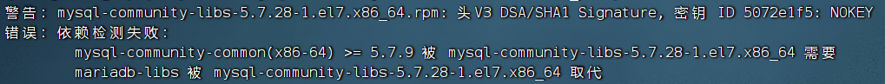
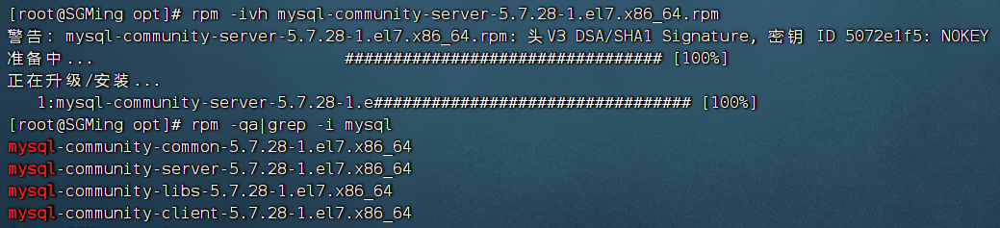
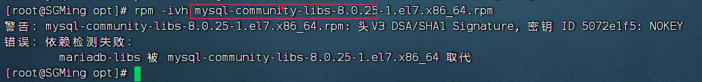

[TOC]


# 1. 安装mysql

## 1.1 依赖检测失败

### 1.1.1 安装common出现了错误

#### 错误信息

 mysql-community-common(x86-64) >= 5.7.9 被 mysql-community-libs-5.7.28-1.el7.x86_64 需要mariadb-libs 被 mysql-community-libs-5.7.28-1.el7.x86_64 取代



#### 解决

 执行下面指令，然后从common开始重新安装一次

```shell
yum remove mysql-libs
```

### 1.1.2 安装service出现了错误

#### 错误信息

```tex
错误：依赖检测失败：
        /usr/bin/perl 被 mysql-community-server-5.7.28-1.el7.x86_64 需要
        perl(Getopt::Long) 被 mysql-community-server-5.7.28-1.el7.x86_64 需要
        perl(strict) 被 mysql-community-server-5.7.28-1.el7.x86_64 需要
```


我们查看安装了那些

```shell
rpm -qa|grep -i mysql # common,client,libs安装成功，service失败
```

#### 解决

```shell
yum install -y perl-Module-Install.noarch
# 重新安装
rpm -ivh mysql-community-server-5.7.28-1.el7.x86_64.rpm
# 重新查看安装了那些
```



> 这样就成功了

### 1.1.3 安装libs错误

#### 错误信息

```tex
错误：依赖检测失败：
        mariadb-libs 被 mysql-community-libs-8.0.25-1.el7.x86_64 取代
```



#### 解决

```shell
yum remove mysql-libs
# 重新安装libs
rpm -ivh mysql-community-libs-8.0.25-1.el7.x86_64.rpm
```

