[TOC]

# 1. 用户管理

## 1.1 登录MySQL服务器

启动MySQL服务后，可以通过mysql命令来登录MySQL服务器，命令如下：

```mysql
mysql –h hostname|hostIP –P port –u username –p [DatabaseName] –e "SQL语句"
```

下面详细介绍命令中的参数：

- `-h参数`: 后面接主机名或者主机IP，hostname为主机，hostIP为主机IP。
- `-P参数`: 后面接MySQL服务的端口，通过该参数连接到指定的端口。MySQL服务的默认端口是3306， 不使用该参数时自动连接到3306端口，port为连接的端口号。
- `-u参数`: 后面接用户名，username为用户名。
- `-p参数`: 密码
- `DatabaseName参数`: 指明登录到哪一个数据库中。如果没有该参数，就会直接登录到MySQL数据库 中，然后可以使用USE命令来选择数据库。
- `-e参数`: 后面可以直接加SQL语句。登录MySQL服务器以后即可执行这个SQL语句，然后退出MySQL 服务器。

**举例**

```shell
mysql -uroot -p -hlocalhost -P3306 mysql -e "select host,user from user"
```

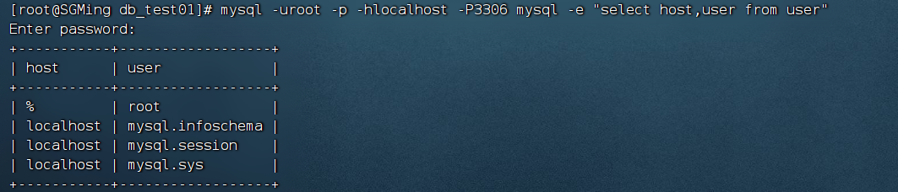


## 1.2 创建用户

CREATE USER语句的基本语法形式如下：

```mysql
CREATE USER 用户名 [IDENTIFIED BY '密码'][,用户名 [IDENTIFIED BY '密码']];
```

- 用户名参数表示新建用户的账户，由 `用户（User） 和 主机名（Host）` 构成； 
- “[ ]”表示可选，也就是说，可以指定用户登录时需要密码验证，也可以不指定密码证，这样用户可以直接登录。不过，不指定密码的方式不安全，不推荐使用。如果指定密码值，这里需要使用 IDENTIFIED BY指定明文密码值
- CREATE USER语句可以同时创建多个用户。

**举例：**

```mysql
CREATE USER zhang3 IDENTIFIED BY '123123'; # 默认host是 %
CREATE USER 'kangshifu'@'localhost' IDENTIFIED BY '123456'; # 推荐使用这种方式创建用户
```

## 1.3 修改用户

修改用户名：

```mysql
UPDATE mysql.user SET USER='li4' WHERE USER='wang5';
FLUSH PRIVILEGES; # 一定要做这一步，否则没有效果
```

## 1.4 删除用户

==方式1：使用DROP方式删除（推荐）==

使用DROP USER语句来删除用户时，必须用于DROP USER权限。DROP USER语句的基本语法形式如下：

```mysql
DROP USER user[,user]…;
```

举例

```mysql
DROP USER li4; # 默认删除host为%的用户
DROP USER 'kangshifu'@'localhost'; 
```

==方式2：使用DELETE方式删除==

```mysql
DELETE FROM mysql.user WHERE Host=’hostname’ AND User=’username’;
FLUSH PRIVILEGES;# 要使用FLUSH命令来使用户生效
# 举例
DELETE FROM mysql.user WHERE Host='localhost' AND User='HXPing';
FLUSH PRIVILEGES;
```

> 注意：不推荐通过 `DELETE FROM USER u WHERE USER='li4' 进行删除`，系统会有残留信息保留。而drop user命令会删除用户以及对应的权限，执行命令后你会发现mysql.user表和mysql.db表 的相应记录都消失了。

## 1.5 设置当前用户密码

旧的写法如下 ：

```mysql
# 修改当前用户的密码：（MySQL5.7测试有效）
SET PASSWORD = PASSWORD('123456'); # MySQL8.0把PASSWORD函数删除了，使用无法使用这个方式
```

这里介绍 `推荐的写法` ：

==1.使用ALTER USER命令来修改当前用户密码==用户可以使用ALTER命令来修改自身密码，如下语句代表修改`当前登录用户`的密码。基本语法如下：

```mysql
ALTER USER USER() IDENTIFIED BY 'new_password';
```

==2.使用SET语句来修改当前用户密码== 使用root用户登录MySQL后，可以使用SET语句来修改密码，具体 SQL语句如下：

```mysql
SET PASSWORD='new_password';
```

> 该语句会自动将密码加密后再赋给当前用户。

## 1.6 修改其它用户密码

==1.使用ALTER语句来修改普通用户的密码== 可以使用ALTER USER语句来修改普通用户的密码。基本语法形 式如下：

```mysql
ALTER USER user [IDENTIFIED BY '新密码']
[,user[IDENTIFIED BY '新密码']]…;
# 例子
ALTER USER 'HXPing'@'localhost' IDENTIFIED BY 'sgming';
```

==2.使用SET命令来修改普通用户的密码== 使用root用户登录到MySQL服务器后，可以使用SET语句来修改普 通用户的密码。SET语句的代码如下：

```mysql
SET PASSWORD FOR 'username'@'hostname'='new_password';
# 例子
SET PASSWORD FOR 'HXPing'@'localhost'='hxping';
```

3.使用UPDATE语句修改普通用户的密码（==不推荐==）

```mysql
UPDATE MySQL.user SET authentication_string=PASSWORD("123456")
WHERE User = "username" AND Host = "hostname";
```

## 1.7 MySQL8密码管理(了解)

### 1. 密码过期策略

- 在MySQL中，数据库管理员可以 `手动设置` 账号密码过期，也可以建立一个 `自动` 密码过期策略。
- 过期策略可以是 `全局的` ，也可以为 `每个账号` 设置单独的过期策略。

```mysql
ALTER USER user PASSWORD EXPIRE;
```

练习：

```mysql
ALTER USER 'kangshifu'@'localhost' PASSWORD EXPIRE; # 立即过期
```

- 方式①：使用SQL语句更改该变量的值并持久化

```mysql
SET PERSIST default_password_lifetime = 180; # 建立全局策略，设置密码每隔180天过期
```

- 方式②：配置文件my.cnf中进行维护

```tex
[mysqld]
default_password_lifetime=180 #建立全局策略，设置密码每隔180天过期
```

==手动设置指定时间过期方式2：单独设置==

每个账号既可延用全局密码过期策略，也可单独设置策略。在 `CREATE USER` 和 `ALTER USER` 语句上加 入 `PASSWORD EXPIRE` 选项可实现单独设置策略。下面是一些语句示例。

```mysql
#设置kangshifu账号密码每90天过期：
CREATE USER 'kangshifu'@'localhost' PASSWORD EXPIRE INTERVAL 90 DAY;
ALTER USER 'kangshifu'@'localhost' PASSWORD EXPIRE INTERVAL 90 DAY;
#设置密码永不过期：
CREATE USER 'kangshifu'@'localhost' PASSWORD EXPIRE NEVER;
ALTER USER 'kangshifu'@'localhost' PASSWORD EXPIRE NEVER;
#延用全局密码过期策略：
CREATE USER 'kangshifu'@'localhost' PASSWORD EXPIRE DEFAULT;
ALTER USER 'kangshifu'@'localhost' PASSWORD EXPIRE DEFAULT;
```

### 2. 密码重用策略

- ==手动设置密码重用方式1：全局==

  - ==方式①：使用SQL==

    ```mysql
    SET PERSIST password_history = 6; #设置不能选择最近使用过的6个密码
    SET PERSIST password_reuse_interval = 365; #设置不能选择最近一年内的密码
    ```

  - ==方式②：my.cnf配置文件==

    ```tex
    [mysqld]
    password_history=6
    password_reuse_interval=365
    ```

- ==手动设置密码重用方式2：单独设置==

```mysql
#不能使用最近5个密码：
CREATE USER 'kangshifu'@'localhost' PASSWORD HISTORY 5;
ALTER USER 'kangshifu'@'localhost' PASSWORD HISTORY 5;

#不能使用最近365天内的密码：
CREATE USER 'kangshifu'@'localhost' PASSWORD REUSE INTERVAL 365 DAY;
ALTER USER 'kangshifu'@'localhost' PASSWORD REUSE INTERVAL 365 DAY;

#既不能使用最近5个密码，也不能使用365天内的密码
CREATE USER 'kangshifu'@'localhost'
PASSWORD HISTORY 5
PASSWORD REUSE INTERVAL 365 DAY;

ALTER USER 'kangshifu'@'localhost'
PASSWORD HISTORY 5
PASSWORD REUSE INTERVAL 365 DAY;
```

# 2. 权限管理

## 2.1 权限列表

MySQL到底都有哪些权限呢？

```mysql
show privileges;
```

- `CREATE和DROP权限` ，可以创建新的数据库和表，或删除（移掉）已有的数据库和表。如果将 MySQL数据库中的DROP权限授予某用户，用户就可以删除MySQL访问权限保存的数据库。

- `SELECT、INSERT、UPDATE和DELETE权限` 允许在一个数据库现有的表上实施操作。
- `SELECT权限` 只有在它们真正从一个表中检索行时才被用到。 
- `INDEX权限` 允许创建或删除索引，INDEX适用于已 有的表。如果具有某个表的CREATE权限，就可以在CREATE TABLE语句中包括索引定义。
- `ALTER权限` 可以使用ALTER TABLE来更改表的结构和重新命名表。
- `CREATE ROUTINE`权限 用来创建保存的 程序（函数和程序），`ALTER ROUTINE`权限用来更改和删除保存的程序， `EXECUTE权限` 用来执行保存的 程序。
- `GRANT权限` 允许自己拥有的前线授权给其他用户，可用于数据库、表和保存的程序。
- `FILE权限` 使用 户可以使用LOAD DATA INFILE和SELECT ... INTO OUTFILE语句读或写服务器上的文件，任何被授予FILE权 限的用户都能读或写MySQL服务器上的任何文件（说明用户可以读任何数据库目录下的文件，因为服务 器可以访问这些文件）。

## 2.2 授予权限的原则

权限控制主要是出于安全因素，因此需要遵循以下几个` 经验原则` ：

1、只授予能 `满足需要的最小权限` ，防止用户干坏事。比如用户只是需要查询，那就只给select权限就可 以了，不要给用户赋予update、insert或者delete权限。

2、创建用户的时候 `限制用户的登录主机` ，一般是限制成指定IP或者内网IP段。

3、为每个用户 `设置满足密码复杂度的密码` 。

4、` 定期清理不需要的用户` ，回收权限或者删除用户。

## 2.3 授予权限

给用户授权的方式有 2 种，分别是通过把` 角色赋予用户给用户授权 `和 `直接给用户授权 `。用户是数据库的 使用者，我们可以通过给用户授予访问数据库中资源的权限，来控制使用者对数据库的访问，消除安全 隐患。

授权命令：

```mysql
GRANT 权限1,权限2,…权限n ON 数据库名称.表名称 TO 用户名@用户地址 [IDENTIFIED BY ‘密码口令’];

# 例如,把db_test03下所有的表的查询和更新赋予了HXPing
GRANT SELECT, UPDATE ON db_test03.* TO 'HXPing'@'localhost';
```

```mysql
# 把所有权限给SGMing，并且可以通过网络登录
# 下面的命令在MySQL5.7没有错，但是在MySQL8.0无法运行
GRANT ALL PRIVILEGES ON *.* TO 'SGMing'@'%' IDENTIFIED BY 'SGMing@p1314';

# MySQL8.0解决，我们分两步来
CREATE USER 'SGMing'@'%' IDENTIFIED BY 'SGMing@p1314';
GRANT ALL PRIVILEGES ON *.* TO 'SGMing'@'%';
```

MySQL8.0

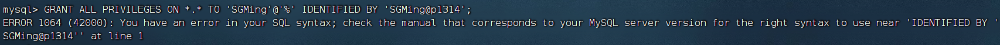

MySQL5.7

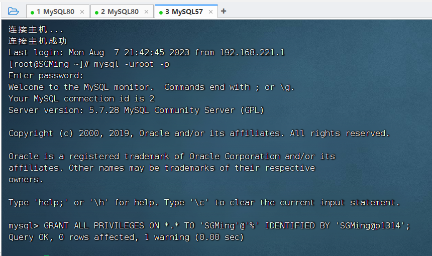

- 该权限如果发现没有该用户，则会直接新建一个用户。

> 我们在开发应用的时候，经常会遇到一种需求，就是要根据用户的不同，对数据进行横向和纵向的 分组。 所谓横向的分组，就是指用户可以接触到的数据的范围，比如可以看到哪些表的数据； 所谓纵向的分组，就是指用户对接触到的数据能访问到什么程度，比如能看、能改，甚至是 删除。

## 2.4 查看权限

- 查看当前用户权限

```mysql
SHOW GRANTS;
# 或
SHOW GRANTS FOR CURRENT_USER;
# 或
SHOW GRANTS FOR CURRENT_USER();
```

- 查看某用户的全局权限

```mysql
SHOW GRANTS FOR 'user'@'主机地址' ;
```

## 2.5 收回权限

收回权限就是取消已经赋予用户的某些权限。==收回用户不必要的权限可以在一定程度上保证系统的安全性==。MySQL中使用 `REVOKE语句` 取消用户的某些权限。使用REVOKE收回权限之后，用户账户的记录将从 db、host、tables_priv和columns_priv表中删除，但是用户账户记录仍然在user表中保存（删除user表中 的账户记录使用DROP USER语句）。

==注意：在将用户账户从user表删除之前，应该收回相应用户的所有权限。==

```mysql
# REVOKE 权限1,权限2,…权限n ON 数据库名称.表名称 FROM 用户名@用户地址;

#收回全库全表的所有权限
REVOKE ALL PRIVILEGES ON *.* FROM 'SGMing'@'%';

#收回mysql库下的所有表的插删改查权限
REVOKE SELECT,INSERT,UPDATE,DELETE ON mysql.* FROM joe@localhost;
```

> 须用户重新登录后才能生效

# 3. 权限表

MySQL服务器通过 `权限表` 来==控制用户对数据库的访问==，权限表存放在 `mysql数据库` 中。MySQL数据库系统会根据这些权限表的内容为每个用户赋予相应的权限。这些权限表中最重要的是 `user表、db表 `。除此之外，还有
`table_priv表`、`column_priv表`和`proc_priv表`等。==在MySOL启动时，服务器将这些数据库表中权限信息的==

## 3.1 user表

user表是MySQL中最重要的一个权限表， 记录用户账号和权限信息 ，有49个字段。如下图：

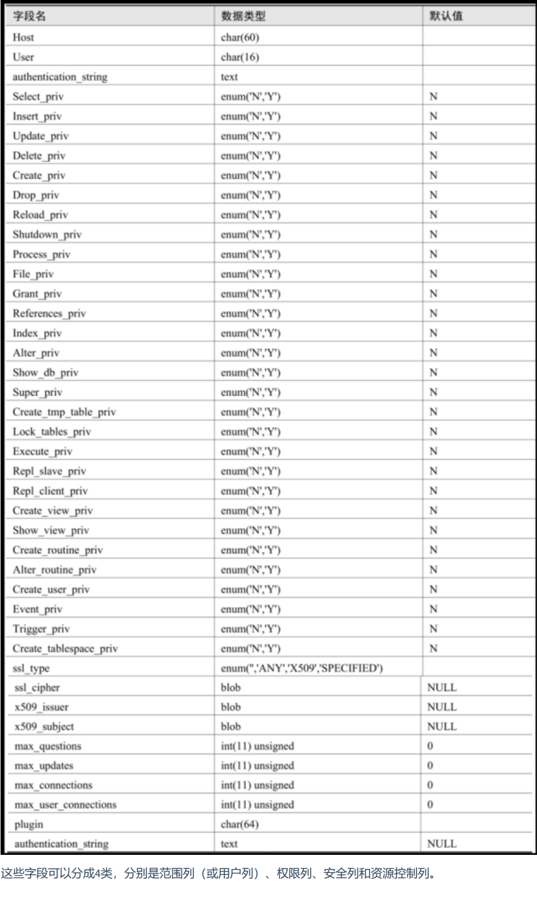

==**1.范围列（或用户列）**==

- host: 表示连接类型
  - `%`：表示所有远程连接通过TCP的连接
  - `IP地址`：如 (192.168.1.2、127.0.0.1) 通过制定ip地址进行的TCP方式的连接
  - `机器名`：通过制定网络中的机器名进行的TCP方式的连接
  - `::1`：IPv6的本地ip地址，等同于IPv4的 127.0.0.1
  - `localhost`：本地方式通过命令行方式的连接 ，比如mysql -u xxx -p xxx 方式的连接。
- user ： 表示用户名，同一用户通过不同方式链接的权限是不一样的。
- password ： 密码
  - 所有密码串通过 password(明文字符串) 生成的密文字符串。MySQL 8.0 在用户管理方面增加了 角色管理，默认的密码加密方式也做了调整，由之前的 `SHA1 `改为了 `SHA2` ，不可逆 。同时 加上 MySQL 5.7 的禁用用户和用户过期的功能，MySQL 在用户管理方面的功能和安全性都较之 前版本大大的增强了。
  - mysql 5.7 及之后版本的密码保存到 `authentication_string `字段中不再使用password 字 段。

==**2.权限列**==

- Grant_priv字段：表示是否拥有GRANT权限
- Shutdown_priv字段：表示是否拥有停止MySQL服务的权限
- Super_priv字段：Super_priv字段
- Execute_priv字段：表示是否拥有EXECUTE权限。拥有EXECUTE权限，可以执行存储过程和函数。
- Select_priv , Insert_priv等：为该用户所拥有的权限。

==3.安全列== 安全列只有6个字段，其中两个是ssl相关的（ssl_type、ssl_cipher），用于 `加密` ；两个是x509 相关的（x509_issuer、x509_subject），用于 `标识用户` ；另外两个Plugin字段用于` 验证用户身份` 的插件， 该字段不能为空。如果该字段为空，服务器就使用内建授权验证机制验证用户身份。

==4.资源控制列== 资源控制列的字段用来 限制用户使用的资源 ，包含4个字段，分别为：

- ①max_questions，用户每小时允许执行的查询操作次数；
- ②max_updates，用户每小时允许执行的更新 操作次数；
- ③max_connections，用户每小时允许执行的连接操作次数；
- ④max_user_connections，用户 允许同时建立的连接次数。

查看字段：

```mysql
DESC mysql.user;
```

查看用户, 以列的方式显示数据：

```mysql
SELECT * FROM mysql.user \G;
```

查询特定字段：

```mysql
SELECT host,user,authentication_string,select_priv,insert_priv,drop_priv FROM mysql.user;
```

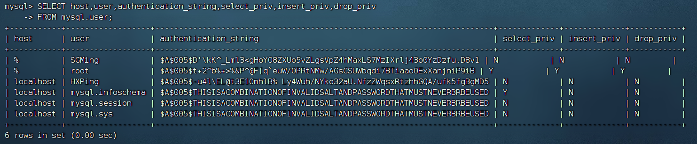

## 3.2 db表

使用DESCRIBE查看db表的基本结构：

```mysql
DESCRIBE mysql.db;
```

==1.用户列== db表用户列有3个字段，分别是Host、User、Db。这3个字段分别表示主机名、用户名和数据库 名。表示从某个主机连接某个用户对某个数据库的操作权限，这3个字段的组合构成了db表的主键。

==2.权限列== Create_routine_priv和Alter_routine_priv这两个字段决定用户是否具有创建和修改存储过程的权限。

## 3.3 tables_priv表和columns_priv表

tables_priv表用来 `对表设置操作权限` ，columns_priv表用来对表的 `某一列设置权限 `。tables_priv表和 columns_priv表的结构分别如图：

```mysql
desc mysql.tables_priv;
```

tables_priv表有8个字段，分别是Host、Db、User、Table_name、Grantor、Timestamp、Table_priv和 Column_priv，各个字段说明如下：

- `Host `、 `Db `、 `User` 和 `Table_name` 四个字段分别表示主机名、数据库名、用户名和表名。
- Grantor表示修改该记录的用户。
- Timestamp表示修改该记录的时间。
- `Table_priv `表示对象的操作权限。包括Select、Insert、Update、Delete、Create、Drop、Grant、 References、Index和Alter。
- Column_priv字段表示对表中的列的操作权限，包括Select、Insert、Update和References。

```mysql
desc mysql.columns_priv;
```

## 3.4 procs_priv表

procs_priv表可以对 `存储过程和存储函数设置操作权限` ，表结构如图：

```mysql
desc mysql.procs_priv;
```

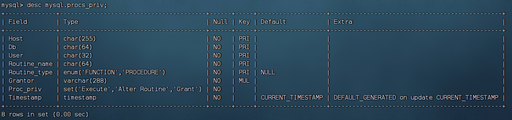

# 4. 访问控制(了解)

正常情况下，并不希望每个用户都可以执行所有的数据库操作。当MySQL允许一个用户执行各种操作时，它将首
先核实该用户向MySQL服务器发送的连接请求，然后确认用户的操作请求是否被允许。这个过程称为MySQL中的
`访问控制过程` 。MySQL的访问控制分为两个阶段: `连接核实阶段`和 `请求核实阶段`。

## 4.1 连接核实阶段

当用户试图连接MySQL服务器时，服务器基于用户的身份以及用户是否能提供正确的密码验证身份来确 定接受或者拒绝连接。即客户端用户会在连接请求中提供用户名、主机地址、用户密码，MySQL服务器 接收到用户请求后，会==使用user表中的host、user和authentication_string这3个字段匹配客户端提供信息==。

服务器只有在user表记录的Host和User字段匹配客户端主机名和用户名，并且提供正确的密码时才接受 连接。==如果连接核实没有通过，服务器就完全拒绝访问；否则，服务器接受连接，然后进入阶段2等待 用户请求。==

## 4.2 请求核实阶段

一旦建立了连接，服务器就进入了访问控制的阶段2，也就是请求核实阶段。对此连接上进来的每个请 求，服务器检查该请求要执行什么操作、是否有足够的权限来执行它，这正是需要授权表中的权限列发 挥作用的地方。这些权限可以来自user、db、table_priv和column_priv表。

确认权限时，MySQL首先 `检查user表` ，如果指定的权限没有在user表中被授予，那么MySQL就会继续 检 `查db表` ，db表是下一安全层级，其中的权限限定于数据库层级，在该层级的SELECT权限允许用户查看指 定数据库的所有表中的数据；如果在该层级没有找到限定的权限，则MySQL继续 `检查tables_priv表` 以及 `columns_priv表 `，如果所有权限表都检查完毕，但还是没有找到允许的权限操作，MySQL将 `返回错误信息` ，用户请求的操作不能执行，操作失败。

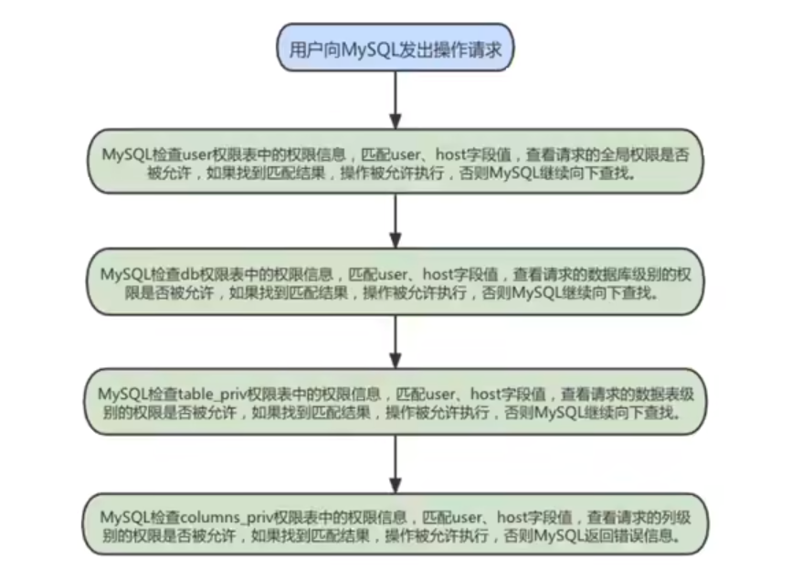

> 提示： MySQL通过向下层级的顺序（从user表到columns_priv表）检查权限表，但并不是所有的权限都要执行该过程。例如，一个用户登录到MySQL服务器之后只执行对MySQL的管理操作，此时只涉及管理权限，因此MySQL只检查user表。另外，如果请求的权限操作不被允许，MySQL也不会继续检查下一层级的表。

# 5. 角色管理

## 5.1 角色的理解

引入角色的目的是 `方便管理拥有相同权限的用户` 。==恰当的权限设定，可以确保数据的安全性，这是至关重要的。==

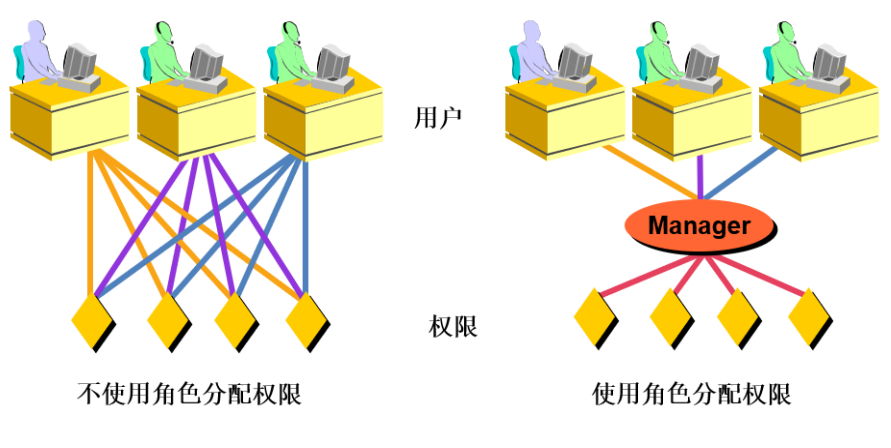

## 5.2 创建角色

创建角色使用 `CREATE ROLE` 语句，语法如下：

```mysql
# CREATE ROLE 'role_name'[@'host_name'] [,'role_name'[@'host_name']]...

# 案例
CREATE ROLE 'admin'@'%';
CREATE ROLE 'manager'@'%';
```

角色名称的命名规则和用户名类似。如果`host_name省略，默认为% `， role_name不可省略，不可为空。

## 5.3 给角色赋予权限

创建角色之后，默认这个角色是没有任何权限的，我们需要给角色授权。给角色授权的语法结构是：

```mysql
# GRANT privileges ON table_name TO 'role_name'[@'host_name'];

# 案例
GRANT SELECT,UPDATE ON db_test03.emp1 TO 'manager'@'%';
GRANT select,update,delete ON db_test03.* TO 'admin'@'%';
```

上述语句中`privileges`代表权限的名称，多个权限以逗号隔开。可使用SHOW语句查询权限名称

## 5.4 查看角色的权限

赋予角色权限之后，我们可以通过 SHOW GRANTS 语句，来查看权限是否创建成功了：

```mysql
SHOW GRANTS FOR 'manager';
```

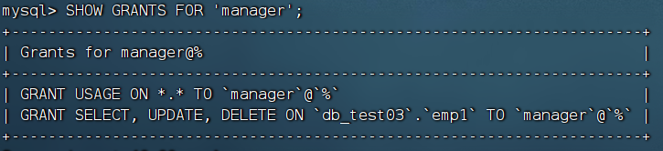

只要你创建了一个角色，系统就会自动给你一个“ `USAGE `”权限，意思是 `连接登录数据库的权限` 。代码的 最后三行代表了我们给角色“manager”赋予的权限

## 5.5 回收角色的权限

角色授权后，可以对角色的权限进行维护，对权限进行添加或撤销。添加权限使用GRANT语句，与角色 授权相同。撤销角色或角色权限使用REVOKE语句。

修改了角色的权限，会影响拥有该角色的账户的权限。

撤销角色权限的SQL语法如下：

```mysql
# REVOKE privileges ON tablename FROM 'rolename';

# 案例：移除manager的DELETE权限
REVOKE DELETE ON db_test03.emp1 FROM 'manager';
```

## 5.6 删除角色

当我们需要对业务重新整合的时候，可能就需要对之前创建的角色进行清理，删除一些不会再使用的角 色。删除角色的操作很简单，你只要掌握语法结构就行了。

```mysql
DROP ROLE role [,role2]...
```

> 注意， `如果你删除了角色，那么用户也就失去了通过这个角色所获得的所有权限 。`

## 5.7 给用户赋予角色

角色创建并授权后，要赋给用户并处于 `激活状态` 才能发挥作用。给用户添加角色可使用GRANT语句，语 法形式如下：

```mysql
# GRANT role [,role2,...] TO user [,user2,...];

# 案例
GRANT 'manager'@'%' TO 'SGMing'@'%';
SHOW GRANTS FOR 'SGMing'@'%';# 查看权限
# 切换SGMing登录，然后查询当前角色是否激活
SELECT CURRENT_ROLE();
```

在上述语句中，role代表角色，user代表用户。可将多个角色同时赋予多个用户，用逗号隔开即可。

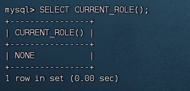

## 5.8 激活角色

==方式1：使用set default role 命令激活角色==

```mysql
SET DEFAULT ROLE ALL TO 'SGMing'@'%';
```

> 然后退出登录，在查询是否激活`SELECT CURRENT_ROLE();`

==方式2：将activate_all_roles_on_login设置为ON==

- 默认情况：

```mysql
show variables like 'activate_all_roles_on_login';
```

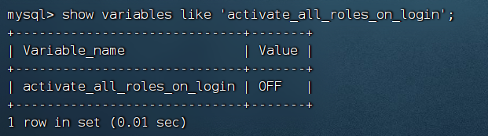

- 设置：

```mysql
SET GLOBAL activate_all_roles_on_login=ON;
```

这条 SQL 语句的意思是，对 所有角色永久激活 。运行这条语句之后，用户才真正拥有了赋予角色的所有 权限。

## 5.9 撤销用户的角色

撤销用户角色的SQL语法如下：

```mysql
# REVOKE role FROM user;

# 案例
REVOKE 'manager'@'%' FROM 'SGMing'@'%';
# 撤销后，执行如下查询语句，查看kangshifu用户的角色信息
SHOW GRANTS FOR 'kangshifu'@'localhost'; 
```

## 5.10 设置强制角色(mandatory role)

方式1：服务启动前设置

```tex
[mysqld]
mandatory_roles='role1,role2@localhost,r3@%.atguigu.com'
```

方式2：运行时设置

```mysql
SET PERSIST mandatory_roles = 'role1,role2@localhost,r3@%.example.com'; #系统重启后仍然
有效
SET GLOBAL mandatory_roles = 'role1,role2@localhost,r3@%.example.com'; #系统重启后失效
```

