[TOC]


# 1. 函数的理解

## 1.1 什么是函数

函数在计算机语言的使用中贯穿始终，函数的作用是什么呢？它可以把我们经常使用的代码封装起来， 需要的时候直接调用即可。这样既` 提高了代码效率` ，又 `提高了可维护性` 。在 SQL 中我们也可以使用函数 对检索出来的数据进行函数操作。使用这些函数，可以极大地 `提高用户对数据库的管理效率` 。

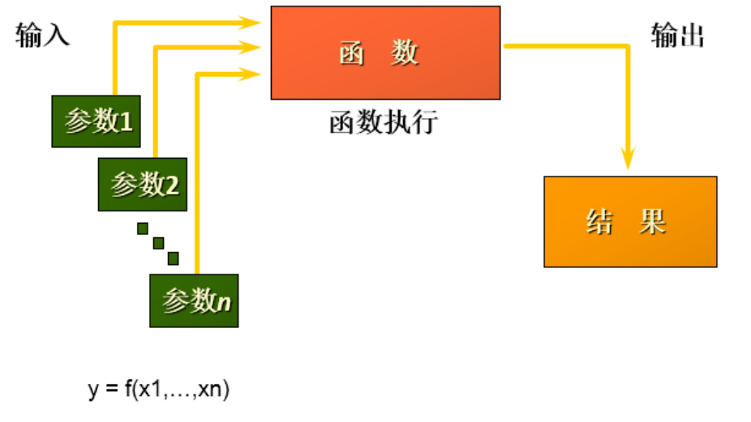

从函数定义的角度出发，我们可以将函数分成 `内置函数` 和 `自定义函数` 。在 SQL 语言中，同样也包括了 内置函数和自定义函数。内置函数是系统内置的通用函数，而自定义函数是我们根据自己的需要编写 的，本章及下一章讲解的是 SQL 的内置函数。

## 1.2 不同DBMS函数的差异

我们在使用 SQL 语言的时候，不是直接和这门语言打交道，而是通过它使用不同的数据库软件，即 DBMS。==DBMS 之间的差异性很大，远大于同一个语言不同版本之间的差异。==实际上，只有很少的函数是 被 DBMS 同时支持的。比如，大多数 DBMS 使用(||)或者(+)来做拼接符，而在 MySQL 中的字符串拼 接函数为concat()。大部分 DBMS 会有自己特定的函数，这就意味着==采用 SQL 函数的代码可移植性是很 差的，因此在使用函数的时候需要特别注意。==

## 1.3 MySQL的内置函数及分类

MySQL提供了丰富的内置函数，这些函数使得数据的维护与管理更加方便，能够更好地提供数据的分析 与统计功能，在一定程度上提高了开发人员进行数据分析与统计的效率。

MySQL提供的内置函数从 `实现的功能角度` 可以分为数值函数、字符串函数、日期和时间函数、流程控制 函数、加密与解密函数、获取MySQL信息函数、聚合函数等。这里，我将这些丰富的内置函数再分为两 类： `单行函数 、 聚合函数(或分组函数) 。`

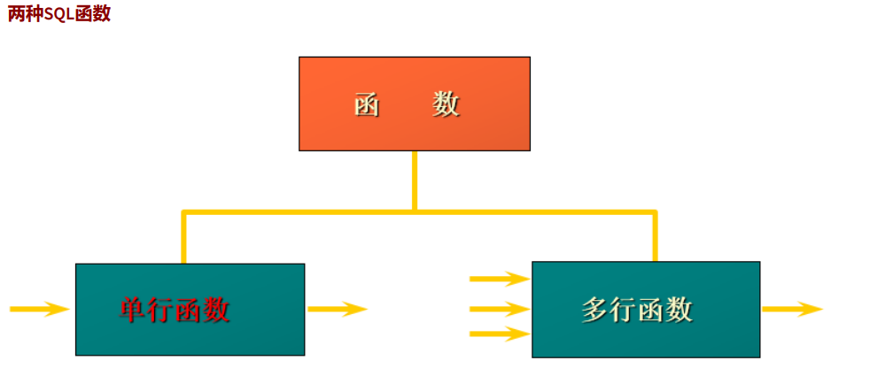

==单行函数==

- 操作数据对象
- 接受参数返回一个结果
- ==只对一行进行变换==
- ==每行返回一个结果==
- 可以嵌套
- 参数可以是一列或一个值


# 2. 数值函数

## 2.1 基本函数

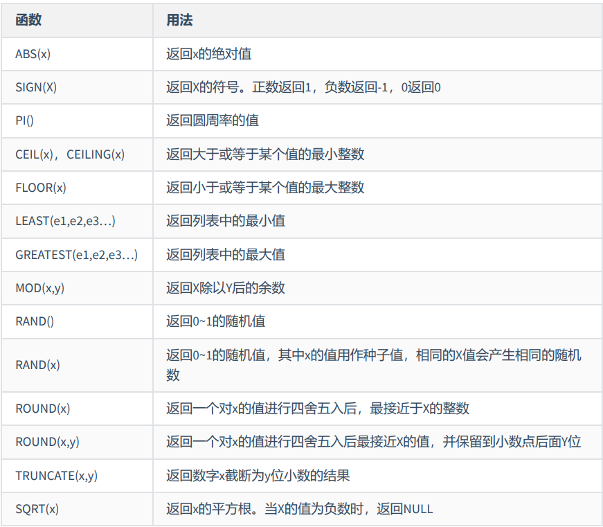

举例：

```sql
SELECT
    ABS(-123),ABS(32),SIGN(-23),
    SIGN(43),PI(),CEIL(32.32),
    CEILING(-43.23),FLOOR(32.32),
    FLOOR(-43.23),MOD(12,5)
FROM DUAL;
```

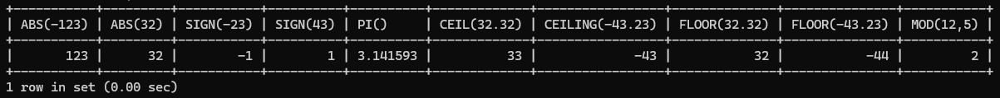

```sql
SELECT RAND(),RAND(),RAND(10),RAND(10),RAND(-1),RAND(-1)
FROM DUAL;
```

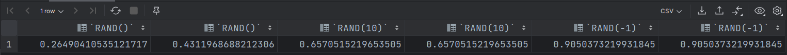

```sql
SELECT
ROUND(12.33),ROUND(12.343,2),ROUND(12.324,-1),TRUNCATE(12.66,1),TRUNCATE(12.66,-1)
FROM DUAL;
```

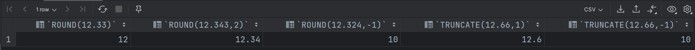

## 2.2 角度与弧度互换函数

| 函数       | 用法                                  |
| ---------- | ------------------------------------- |
| RADIANS(X) | 将角度转化为弧度，其中，参数x为角度值 |
| DEGREES(x) | 将弧度转化为角度，其中，参数x为弧度值 |

```sql
SELECT RADIANS(30),RADIANS(60),RADIANS(90),DEGREES(2*PI()),DEGREES(RADIANS(90))
FROM DUAL;
```

## 2.3 三角函数

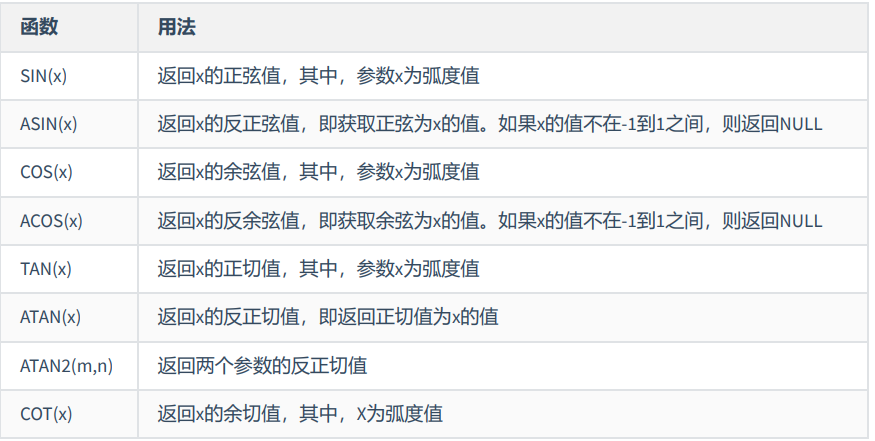

ATAN2(M,N)函数返回两个参数的反正切值。 与ATAN(X)函数相比，ATAN2(M,N)需要两个参数，例如有两个 点point(x1,y1)和point(x2,y2)，使用ATAN(X)函数计算反正切值为ATAN((y2-y1)/(x2-x1))，使用ATAN2(M,N)计 算反正切值则为ATAN2(y2-y1,x2-x1)。由使用方式可以看出，当x2-x1等于0时，ATAN(X)函数会报错，而 ATAN2(M,N)函数则仍然可以计算。

ATAN2(M,N)函数的使用示例如下：

```sql
SELECT
SIN(RADIANS(30)),DEGREES(ASIN(1)),TAN(RADIANS(45)),DEGREES(ATAN(1)),DEGREES(ATAN2(1,1))
FROM DUAL;
```

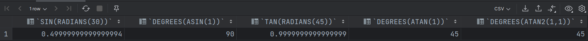

## 2.4 指数与对数

| 函数                   | 用法                                                 |
| ---------------------- | ---------------------------------------------------- |
| POW(x, y), POWER(x, y) | 返回x的y次方                                         |
| EXP(X)                 | 返回e的X次方，其中e是一个常数，2.718281828459045     |
| LN(X)，LOG(X)          | 返回以e为底的X的对数，当X <= 0 时，返回的结果为NULL  |
| LOG10(X)               | 返回以10为底的X的对数，当X <= 0 时，返回的结果为NULL |
| LOG2(X)                | 返回以2为底的X的对数，当X <= 0 时，返回NULL          |

```sql
mysql>  SELECT POW(2,5),POWER(2,4),EXP(2),LN(10),LOG10(10),LOG2(4)
    -> FROM DUAL;
+----------+------------+------------------+-------------------+-----------+---------+
| POW(2,5) | POWER(2,4) | EXP(2)           | LN(10)            | LOG10(10) | LOG2(4) |
+----------+------------+------------------+-------------------+-----------+---------+
|       32 |         16 | 7.38905609893065 | 2.302585092994046 |         1 |       2 |
+----------+------------+------------------+-------------------+-----------+---------+
1 row in set (0.00 sec)	
```

# 3. 字符串函数

| 函数                              | 用法                                                         |
| --------------------------------- | ------------------------------------------------------------ |
| ASCLL(S)                          | 返回字符串S中的第一个字符的ASCII码值                         |
| CHAR_LENGTH(s)                    | 返回字符串s的字符数。作用与CHARACTER_LENGTH(s)相同           |
| LENGTH(s)                         | 返回字符串s的字节数，和字符集有关                            |
| `CONCAT(s1,s2,......,sn) `        | 连接s1,s2,......,sn为一个字符串                              |
| `CONCAT_WS(x, s1,s2,......,sn)`   | 同CONCAT(s1,s2,...)函数，但是每个字符串之间要加上x           |
| INSERT(str, idx, len, replacestr) | 将字符串str从第idx位置开始，len个字符长的子串替换为字符串replacestr |
| REPLACE(str, a, b)                | 用字符串b替换字符串str中所有出现的字符串a                    |
| UPPER(s) 或 UCASE(s)              | 将字符串s的所有字母转成大写字母                              |
| LOWER(s) 或LCASE(s)               | 将字符串s的所有字母转成小写字母                              |
| LEFT(str,n)                       | 返回字符串str最左边的n个字符                                 |
| RIGHT(str,n)                      | 返回字符串str最右边的n个字符                                 |
| LPAD(str, len, pad)               | 用字符串pad对str最左边进行填充，直到str的长度为len个字符     |
| RPAD(str ,len, pad)               | 用字符串pad对str最右边进行填充，直到str的长度为len个字符     |
| LTRIM(s)                          | 去掉字符串s左侧的空格                                        |
| RTRIM(s)                          | 去掉字符串s右侧的空格                                        |
| `TRIM(s) `                        | 去掉字符串s开始与结尾的空格                                  |
| TRIM(s1 FROM s)                   | 去掉字符串s开始与结尾的s1                                    |
| TRIM(LEADING s1 FROM s)           | 去掉字符串s开始处的s1                                        |
| TRIM(TRAILING s1 FROM s)          | 去掉字符串s结尾处的s1                                        |
| REPEAT(str, n)                    | 返回str重复n次的结果                                         |
| SPACE(n)                          | 返回n个空格                                                  |
| STRCMP(s1,s2)                     | 比较字符串s1,s2的ASCII码值的大小                             |
| SUBSTR(s,index,len)               | 返回从字符串s的index位置其len个字符，作用与SUBSTRING(s,n,len)、 MID(s,n,len)相同 |
| LOCATE(substr,str)                | 返回字符串substr在字符串str中首次出现的位置，作用于POSITION(substr IN str)、INSTR(str,substr)相同。未找到，返回0 |
| ELT(m,s1,s2,…,sn)                 | 返回指定位置的字符串，如果m=1，则返回s1，如果m=2，则返回s2，如 果m=n，则返回sn |
| FIELD(s,s1,s2,…,sn)               | 返回字符串s在字符串列表中第一次出现的位                      |
| FIND_IN_SET(s1,s2)                | 返回字符串s1在字符串s2中出现的位置。其中，字符串s2是一个以逗号分 隔的字符串 |
| REVERSE(s)                        | 返回s反转后的字符串                                          |
| NULLIF(value1,value2)             | 比较两个字符串，如果value1与value2相等，则返回NULL，否则返回 value1 |

> 注意：MySQL中，字符串的位置是从1开始的。

举例：

```sql
mysql> SELECT FIELD('mm','hello','msm','amma'),FIND_IN_SET('mm','hello,mm,amma') FROM DUAL;
+----------------------------------+-----------------------------------+
| FIELD('mm','hello','msm','amma') | FIND_IN_SET('mm','hello,mm,amma') |
+----------------------------------+-----------------------------------+
|                                0 |                                 2 |
+----------------------------------+-----------------------------------+
1 row in set (0.00 sec)
```

```sql
mysql>  SELECT NULLIF('mysql','mysql'),NULLIF('mysql', '');
+-------------------------+---------------------+
| NULLIF('mysql','mysql') | NULLIF('mysql', '') |
+-------------------------+---------------------+
| NULL                    | mysql               |
+-------------------------+---------------------+
1 row in set (0.00 sec)
```

# 4. 日期和时间函数

## 4.1 获取日期、时间

| 函数                                                         | 用法                            |
| ------------------------------------------------------------ | ------------------------------- |
| ==CURDATE()== ，CURRENT_DATE()                               | 返回当前日期，只包含年、 月、日 |
| ==CURTIME()== ， CURRENT_TIME()                              | 返回当前时间，只包含时、 分、秒 |
| ==NOW()== / SYSDATE() / CURRENT_TIMESTAMP() / LOCALTIME() / LOCALTIMESTAMP() | 返回当前系统日期和时间          |
| UTC_DATE()                                                   | 返回UTC(世界标准时间) 日期      |
| UTC_TIME()                                                   | 返回UTC(世界标准时间) 时间      |

```sql
mysql> SELECT CONCAT(CURDATE(), ' ', CURTIME());
+-----------------------------------+
| CONCAT(CURDATE(), ' ', CURTIME()) |
+-----------------------------------+
| 2023-07-16 12:53:38               |
+-----------------------------------+
1 row in set (0.00 sec)
```

## 4.2 日期与时间戳的转换

| 函数                     | 用法                                                         |
| ------------------------ | ------------------------------------------------------------ |
| UNIX_TIMESTAMP()         | 以UNIX时间戳的形式返回当前时间。SELECT UNIX_TIMESTAMP() - >1689483392 |
| UNIX_TIMESTAMP(date)     | 将时间date以UNIX时间戳的形式返回。                           |
| FROM_UNIXTIME(timestamp) | 将UNIX时间戳的时间转换为普通格式的时间                       |

```sql
mysql> SELECT UNIX_TIMESTAMP(NOW()) FROM DUAL;
+-----------------------+
| UNIX_TIMESTAMP(NOW()) |
+-----------------------+
|            1689483450 |
+-----------------------+
1 row in set (0.00 sec)
```

```sql
mysql> SELECT FROM_UNIXTIME(1689483450) FROM DUAL;
+---------------------------+
| FROM_UNIXTIME(1689483450) |
+---------------------------+
| 2023-07-16 12:57:30       |
+---------------------------+
1 row in set (0.00 sec)
```

## 4.3 获取月份、星期、星期数、天数等函数

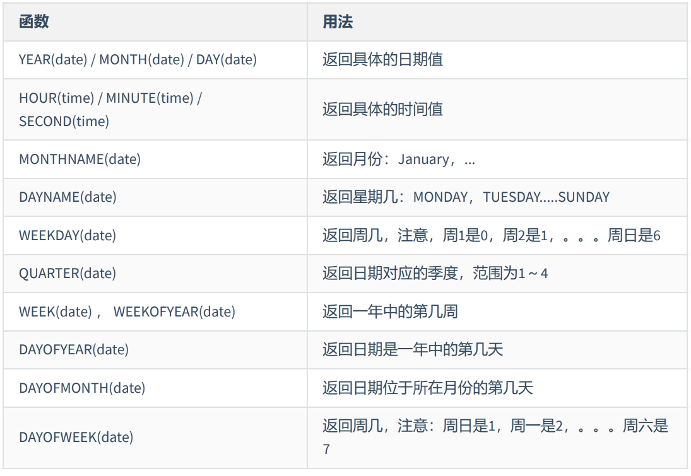

举例：

```sql
SELECT YEAR(CURDATE()),MONTH(CURDATE()),DAY(CURDATE()),
       HOUR(CURTIME()),MINUTE(NOW()),SECOND(SYSDATE())
FROM DUAL;
```

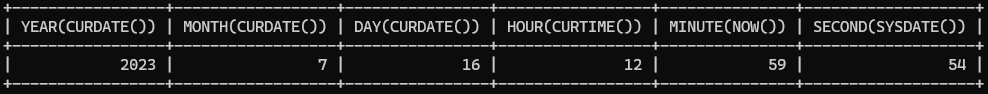

```sql
SELECT MONTHNAME('2021-10-26'),DAYNAME('2021-10-26'),WEEKDAY('2021-10-26'),
       QUARTER(CURDATE()),WEEK(CURDATE()),DAYOFYEAR(NOW()),
       DAYOFMONTH(NOW()),DAYOFWEEK(NOW())
FROM DUAL;
```

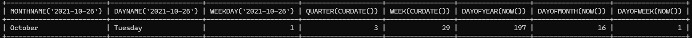

## 4.4 日期的操作函数

| 函数                    | 用法                                       |
| ----------------------- | ------------------------------------------ |
| EXTRACT(type FROM date) | 返回指定日期中特定的部分，type指定返回的值 |

EXTRACT(type FROM date)函数中type的取值与含义：

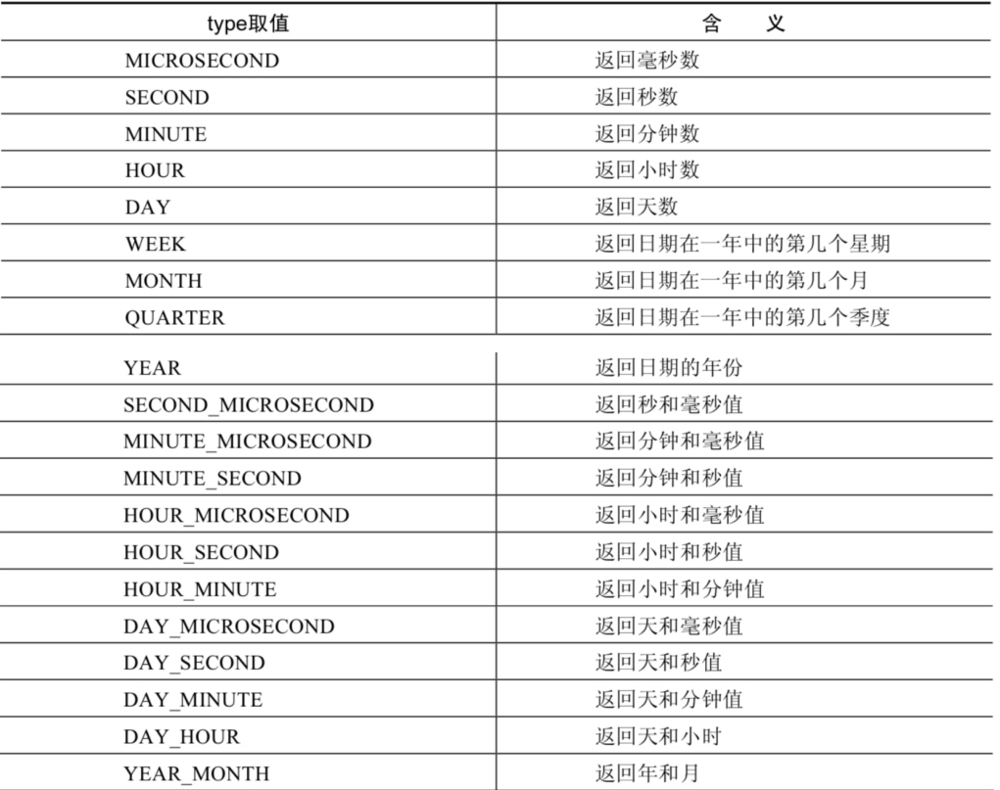

```sql
SELECT EXTRACT(MINUTE FROM NOW()),EXTRACT( WEEK FROM NOW()),
       EXTRACT( QUARTER FROM NOW()),EXTRACT( MINUTE_SECOND FROM NOW())
FROM DUAL;
```

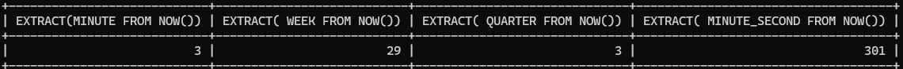

## 4.5 时间和秒钟转换的函数

| 函数                 | 用法                                                         |
| -------------------- | ------------------------------------------------------------ |
| TIME_TO_SEC(time)    | 将 time 转化为秒并返回结果值。转化的公式为： `小时*3600+分钟 *60+秒` |
| SEC_TO_TIME(seconds) | 将 seconds 描述转化为包含小时、分钟和秒的时间                |

举例：

```sql
mysql>  SELECT TIME_TO_SEC(NOW());
+--------------------+
| TIME_TO_SEC(NOW()) |
+--------------------+
|              50307 |
+--------------------+
1 row in set (0.00 sec)
```

```sql
mysql>  SELECT SEC_TO_TIME(78774);
+--------------------+
| SEC_TO_TIME(78774) |
+--------------------+
| 21:52:54           |
+--------------------+
1 row in set (0.00 sec)
```

## 4.6 计算日期和时间的函数

### 第1组：

| 函数                                                         | 用法                                            |
| ------------------------------------------------------------ | ----------------------------------------------- |
| DATE_ADD(datetime, INTERVAL expr type)， ADDDATE(date,INTERVAL expr type) | 返回与给定日期时间相差INTERVAL时 间段的日期时间 |
| DATE_SUB(date,INTERVAL expr type)，<br /> SUBDATE(date,INTERVAL expr type) | 返回与date相差INTERVAL时间间隔的 日期           |

上述函数中type的取值：

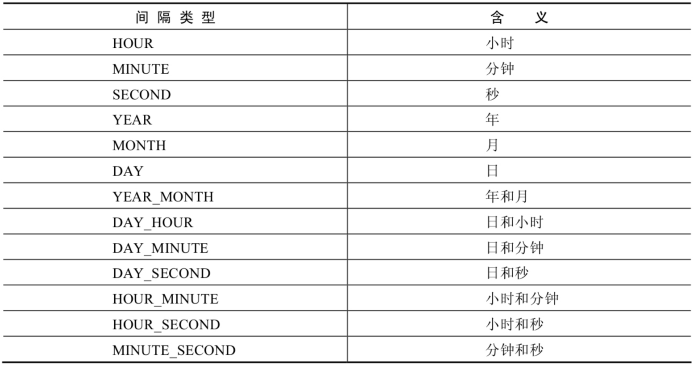

举例：、

```sql
SELECT DATE_ADD(NOW(), INTERVAL 1 DAY)                               AS col1,
       DATE_ADD('2021-10-21 23:32:12', INTERVAL 1 SECOND)            AS col2,
       ADDDATE('2021-10-21 23:32:12', INTERVAL 1 SECOND)             AS col3,
       DATE_ADD('2021-10-21 23:32:12', INTERVAL '1_1' MINUTE_SECOND) AS col4,
       DATE_ADD(NOW(), INTERVAL -1 YEAR)                             AS col5, #可以是负数
       DATE_ADD(NOW(), INTERVAL '1_1' YEAR_MONTH)                    AS col6  #需要单引号
FROM DUAL;
```

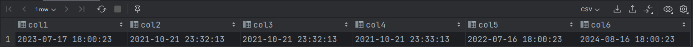

```sql
SELECT DATE_SUB('2021-01-21', INTERVAL 31 DAY)                  AS col1,
       SUBDATE('2021-01-21', INTERVAL 31 DAY)                   AS col2,
       DATE_SUB('2021-01-21 02:01:01', INTERVAL '1 1' DAY_HOUR) AS col3
FROM DUAL;
```

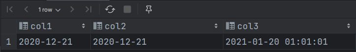

### 第2组：

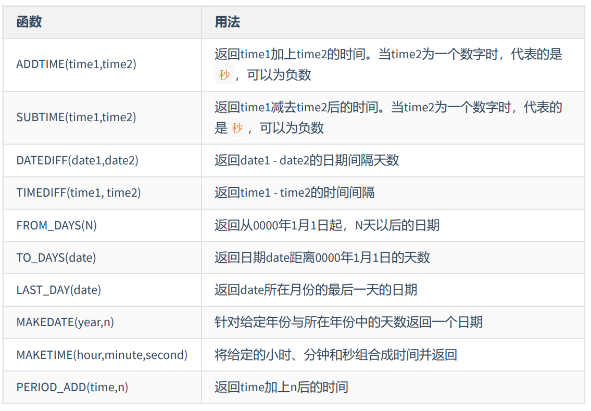

举例：

```sql
SELECT ADDTIME(NOW(), 20),
       SUBTIME(NOW(), 30),
       SUBTIME(NOW(), '1:1:3'),
       DATEDIFF(NOW(), '2021-10-01'),
       TIMEDIFF(NOW(), '2021-10-25 22:10:10'),
       FROM_DAYS(366),
       TO_DAYS('0000-12-25'),
       LAST_DAY(NOW()),
       MAKEDATE(YEAR(NOW()), 12),
       MAKETIME(10, 21, 23),
       PERIOD_ADD(20200101010101, 10)
FROM DUAL;
```

```sql
mysql> SELECT ADDTIME(NOW(), 50);
+---------------------+
| ADDTIME(NOW(), 50)  |
+---------------------+
| 2023-07-16 18:06:15 |
+---------------------+
1 row in set (0.00 sec)
```

```sql
mysql> SELECT ADDTIME(NOW(), '1:1:1');
+-------------------------+
| ADDTIME(NOW(), '1:1:1') |
+-------------------------+
| 2023-07-16 19:06:53     |
+-------------------------+
1 row in set (0.00 sec)
```

```sql
mysql> SELECT SUBTIME(NOW(), '-1:-1:-1');
+----------------------------+
| SUBTIME(NOW(), '-1:-1:-1') |
+----------------------------+
| 2023-07-16 18:06:35        |
+----------------------------+
1 row in set, 1 warning (0.00 sec)
```

举例：查询 7 天内的新增用户数有多少？

```sql
SELECT COUNT(*) as num FROM new_user WHERE TO_DAYS(NOW())-TO_DAYS(regist_time)<=7
```

## 4.7 日期的格式化与解析

| 函数                              | 用法                                       |
| --------------------------------- | ------------------------------------------ |
| DATE_FORMAT(date,fmt)             | 按照字符串fmt格式化日期date值              |
| TIME_FORMAT(time,fmt)             | 按照字符串fmt格式化时间time值              |
| GET_FORMAT(date_type,format_type) | 返回日期字符串的显示格式                   |
| STR_TO_DATE(str, fmt)             | 按照字符串fmt对str进行解析，解析为一个日期 |

上述 `非GET_FORMAT` 函数中fmt参数常用的格式符：

#### ==时间格式符==

| 格式符 | 说明                                                         | 格式符  | 说明                                                         |
| ------ | ------------------------------------------------------------ | ------- | ------------------------------------------------------------ |
| %Y     | 4位数字表示年份                                              | %y      | 表示两位数字表示年份                                         |
| %M     | 月名表示月份(January,....)                                   | %m      | 两位数字表示月份 (01,02,03。。。)                            |
| %b     | 缩写的月名(Jan.，Feb.，....)                                 | %c      | 数字表示月份(1,2,3,...)                                      |
| %D     | 英文后缀表示月中的天数 (1st,2nd,3rd,...)                     | %d      | 两位数字表示月中的天数(01,02...)                             |
| %e     | 数字形式表示月中的天数 (1,2,3,4,5.....)                      |         |                                                              |
| %H     | 两位数字表示小数，24小时制 (01,02..)                         | %h 和%I | 两位数字表示小时，12小时制 (01,02..)                         |
| %k     | 数字形式的小时，24小时制(1,2,3)                              | %l      | 数字形式表示小时，12小时制 （1,2,3,4....）                   |
| %i     | 两位数字表示分钟（00,01,02）                                 | %S 和%s | 两位数字表示秒(00,01,02...)                                  |
| %W     | 一周中的星期名称（Sunday...）                                | %a      | 一周中的星期缩写（Sun.， Mon.,Tues.，..）                    |
| %w     | 以数字表示周中的天数 (0=Sunday,1=Monday....)                 |         |                                                              |
| %j     | 以3位数字表示年中的天数(001,002...)                          | %U      | 以数字表示年中的第几周， （1,2,3。。）其中Sunday为周中第一 天 |
| %u     | 以数字表示年中的第几周， （1,2,3。。）其中Monday为周中第一 天 |         |                                                              |
| %T     | 24小时制                                                     | %r      | 12小时制                                                     |
| %p     | AM或PM                                                       | %%      | 表示%                                                        |

GET_FORMAT函数中date_type和format_type参数取值如下：

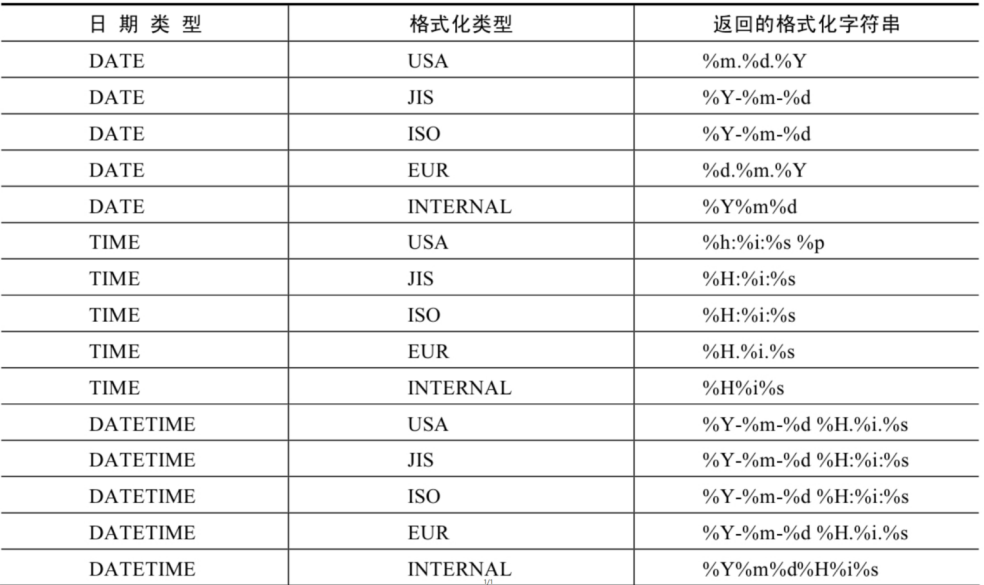

```sql
SELECT STR_TO_DATE('09/01/2009','%m/%d/%Y')
FROM DUAL;
SELECT STR_TO_DATE('20140422154706','%Y%m%d%H%i%s')
FROM DUAL;
SELECT STR_TO_DATE('2014-04-22 15:47:06','%Y-%m-%d %H:%i:%s')
FROM DUAL;
```

```sql
mysql> SELECT STR_TO_DATE('2020-01-01 00:00:00','%Y-%m-%d');
+-----------------------------------------------+
| STR_TO_DATE('2020-01-01 00:00:00','%Y-%m-%d') |
+-----------------------------------------------+
| 2020-01-01                                    |
+-----------------------------------------------+
1 row in set, 1 warning (0.00 sec)
```

## 5. 流程控制函数

流程处理函数可以根据不同的条件，执行不同的处理流程，可以在SQL语句中实现不同的条件选择。 MySQL中的流程处理函数主要包括IF()、IFNULL()和CASE()函数。


```sql
SELECT IF(1 > 0,'正确','错误')
->正确
```

```sql
SELECT IFNULL(null,'Hello Word')
->Hello Word
```

```sql
SELECT CASE
WHEN 1 > 0
THEN '1 > 0'
WHEN 2 > 0
THEN '2 > 0'
ELSE '3 > 0'
END
->1 > 0
```

```sql
SELECT CASE 1
WHEN 1 THEN '我是1'
WHEN 2 THEN '我是2'
ELSE '你是谁'
```

```sql
SELECT employee_id,salary, CASE WHEN salary>=15000 THEN '高薪'
                                WHEN salary>=10000 THEN '潜力股'
                                WHEN salary>=8000 THEN '屌丝'
                                ELSE '草根' END "描述"
FROM employees;
```

```sql
SELECT oid,`status`, CASE `status` WHEN 1 THEN '未付款'
                                   WHEN 2 THEN '已付款'
                                   WHEN 3 THEN '已发货'
                                   WHEN 4 THEN '确认收货'
                                   ELSE '无效订单' END
FROM t_order;
```

==练习：查询部门号为 10,20, 30 的员工信息, 若部门号为 10, 则打印其工资的 1.1 倍, 20 号部门, 则打印其 工资的 1.2 倍, 30 号部门打印其工资的 1.3 倍数。==
